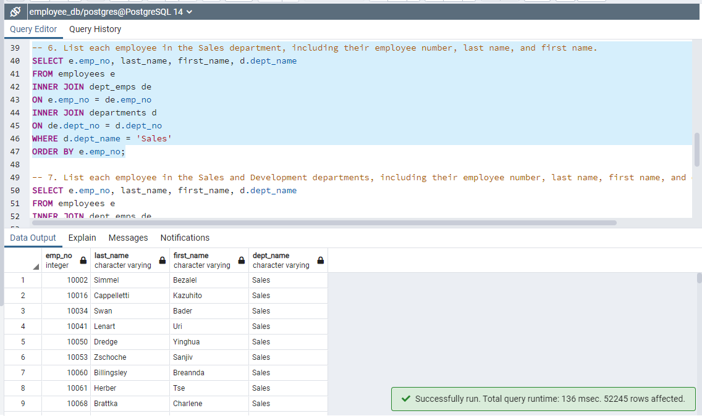

# Reconstructing Pewlett Hackard's Employee Database: Data Modeling, Engineering, and Analysis of 1980s and 1990s Employment Trends

## Resources
Data sources: titles.csv, employees.csv, departments.csv, dept_emp.csv, dept_manager.csv, salaries.csv

Software: pgAdmin 4 Version 6.1; PostgreSQL 14.1

## Project Overview
### Use the provided information to:
1. Create a table schema for each of the six .csv files
2. Import each .csv file into its corresponding SQL table

### Then answer the following questions:
1. List the employee number, last name, first name, sex, and salary of each employee
2. List the first name, last name, and hire date for the employees who were hired in 1986
3. List the manager of each department along with their department number, department name, employee number, last name, and first name
4. List the department number for each employee along with that employee’s employee number, last name, first name, and department name
5. List first name, last name, and sex of each employee whose first name is Hercules and whose last name begins with the letter B
6. List each employee in the Sales department, including their employee number, last name, and first name
7. List each employee in the Sales and Development departments, including their employee number, last name, first name, and department name
8. List the frequency counts, in descending order, of all the employee last names (that is, how many employees share each last name)

## Results & Analysis
First, I created a new database on the ***postgres*** server. I titled the new database ***employee_db***. 

Next, I created the structure of the database and defined the relationships between its objects, also known as the schema. 

The image above displays the code required to create the table schema for the six csv files. The data types have been specified for each column of each table, foreign keys have been referenced, and primary keys have been designated. **Please note** that some primary keys are *composite keys* because it takes more than one column to uniquely identify a row. This is because some values appear more than once in each column. 

After I executed the code for the schema, I began importing each csv file into its corresponding SQL table. To avoid errors, I imported the csv files in the same order as I created the tables.

Now, I can begin to answer the questions presented earlier.

### 1. List the employee number, last name, first name, sex, and salary of each employee

I had to use an ***INNER JOIN*** statement in the query since the employee salary was in the *salaries* table and not the *employees* table.

### 2. List the first name, last name, and hire date for the employees who were hired in 1986

I used the keyword ***BETWEEN*** since I was only interested in employees who were hired in the year 1986.

### 3. List the manager of each department along with their department number, department name, employee number, last name, and first name

I used two ***INNER JOIN*** statements in the query since the department managers and department names were both in different tables.

### 4. List the department number for each employee along with that employee’s employee number, last name, first name, and department name

Similar to the process for question 3, but instead of the department managers table, I substituted the department employees table.

### 5. List first name, last name, and sex of each employee whose first name is Hercules and whose last name begins with the letter B

I used the keyword ***LIKE*** for the second part of the ***WHERE*** clause because all I know about the last name is that it begins with a ***B***, unlike the first part of the ***WHERE*** clause where I know it is equal to ***Hercules***.

### 6. List each employee in the Sales department, including their employee number, last name, and first name

I used two ***INNER JOIN*** statements in the query since the department employees and department names were both in different tables. Then I filtered for employees who were part of the Sales department in the ***WHERE*** clause.

### 7. List each employee in the Sales and Development departments, including their employee number, last name, first name, and department name

Similar to the process for question 6, but I used the ***IN*** keyword within the ***WHERE*** clause since I am interested in employees who were part of the Sales or Development departments. Alternatively, I could have used the ***OR*** keyword to achieve the same results.

### 8. List the frequency counts, in descending order, of all the employee last names (that is, how many employees share each last name)

Since ***COUNT*** is considered an aggregate function, I have to use the ***GROUP BY*** clause for the query to run and display properly.

## Drawing Insights

1. Looking at the output, we can see that there are a total of 300,024 employees in the dataset.
2. There were a total of 36,150 employees hired in 1986. The first employee hired that year was Jiann Bondorf on January 1st, 1986 and the last employee hired that year was Odoardo Heuter on December 31st, 1986.
3. There were a total of 24 managers, with most departments having more than just one manager.
4. There were a total of 331,603 results. This might seem odd since I previously stated that there were only 300,024 employees in the dataset, but if we take a closer look at the results, we can see that some employees are part of more than one department.
5. There were a total of 20 results. The oldest Hercules B. was born in 1952 and the youngest Hercules B. was born in 1964.
6. There were a total of 52,245 employees that were a part of the Sales department.
7. There were a total of 137,952 employees that were a part of the Sales or Development department.
8. There were a total of 1,638 results. The most common last name in the employee database was ***Baba*** with a count of 226. The least common last name in the employee database was ***Foolsday*** with a count of 1.

---

    
Return to the <a href="https://kenlo94.github.io/">Homepage</a>

    
View the Project on <a href="https://github.com/kenlo94/Pewlett-Hackard-Analysis">GitHub</a>

